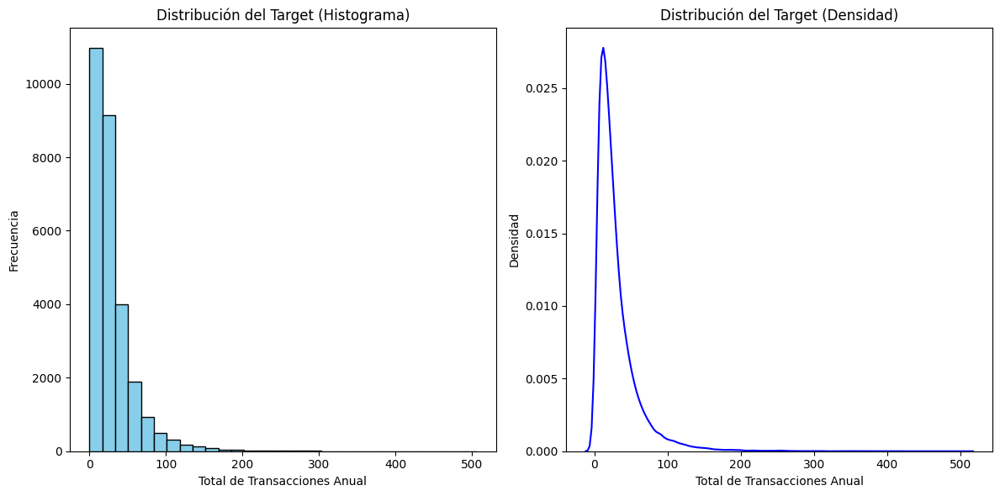
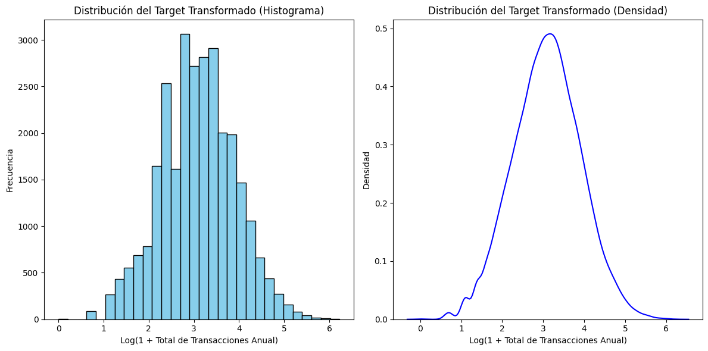
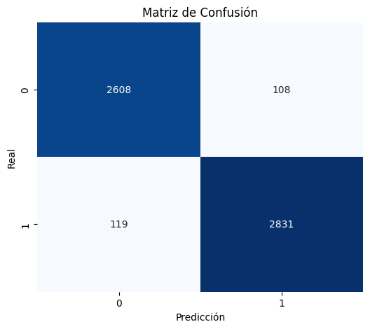
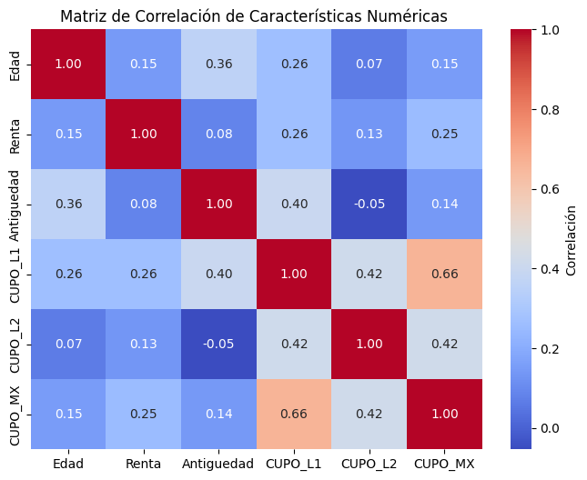

# 🧠 Análisis y Predicción de Comportamiento de Clientes Bancarios

Este proyecto aplica técnicas de análisis exploratorio, limpieza de datos, ingeniería de características y modelado supervisado para identificar patrones de comportamiento en clientes de una institución financiera. El objetivo principal es entender los factores que influyen en la retención y uso de productos bancarios, y construir modelos predictivos tanto de regresión como de clasificación.

---

## 🔍 Exploración de Datos

Durante el análisis exploratorio, se observó una fuerte concentración de transacciones en los rangos bajos. Para abordar el sesgo, se aplicó una transformación logarítmica.

### Distribución del Target (Antes y Después de Transformación)

| Distribución Original | Distribución Transformada |
|------------------------|---------------------------|
|  |  |


---

## 📊 Dataset

El conjunto de datos incluye información detallada sobre clientes de un banco, como:

- Datos demográficos (edad, región, sexo, etc.)
- Información financiera (renta, cupo, productos contratados)
- Actividad transaccional mensual durante un año

Este conjunto de datos fue procesado y transformado para eliminar inconsistencias, valores nulos, y optimizar la calidad de las variables predictoras.

---

## 🔍 Objetivos del Proyecto

- Explorar y analizar variables clave del comportamiento financiero de los clientes.
- Predecir el total anual de transacciones con un modelo de regresión.
- Clasificar la probabilidad de retención o abandono mediante modelos supervisados.
- Aplicar técnicas de codificación, imputación y normalización en un flujo de preparación robusto.

---

## ⚙️ Tecnologías utilizadas

      

[//]: # "- Python 3"
[//]: # "- Jupyter Notebook"
[//]: # "- pandas, numpy"
[//]: # "- scikit-learn"
[//]: # "- matplotlib, seaborn"

---

## 🧪 Modelos Aplicados

- **Regresión Lineal** (modelo base para predicción del total de transacciones).
- **Clasificación con Random Forest** para modelar retención de clientes.
- Evaluación con métricas como `accuracy`, `precision`, `recall`, `f1-score`, y matriz de confusión.

---

## 📊 Evaluación del Modelo de Clasificación

El modelo fue evaluado usando métricas estándar (Accuracy, Recall, F1-score). Se obtuvo un rendimiento balanceado en ambas clases.

### Matriz de Confusión



### Matriz de Correlación entre Variables Relevantes



---

## 📁 Estructura del proyecto

```

├── churn.ipynb
├── requirements.txt
├── README.md
├── .gitignore
└── images/                   
   ├── histograma_target.png
   ├── histograma_target_log.png
   ├── matriz_correlacion.png
   └── matriz_confusion.png
````

---

## 🚀 Cómo ejecutar

1. Clona este repositorio:
```bash
git clone https://github.com/tu_usuario/nombre_repositorio.git
cd nombre_repositorio
````

2. (Opcional) Crea un entorno virtual:

```bash
python -m venv venv
source venv/bin/activate  # En Linux/Mac
venv\Scripts\activate     # En Windows
```

3. Instala dependencias:

```bash
pip install -r requirements.txt
```

4. Abre el notebook:

```bash
jupyter notebook
```

---

## 📌 Notas

* El target de regresión fue transformado logarítmicamente para mejorar la distribución.
* El análisis evitó sobreajuste con validación cruzada y comparación entre rendimiento en entrenamiento y prueba.
* El conjunto final de datos no contiene valores nulos, lo cual simplifica y robustece el proceso de modelado.

---

## 📄 Licencia

Este proyecto está bajo la licencia MIT.

---

## 👥 Autor

Desarrollado por Alexis Martínez. Proyecto académico con fines de análisis predictivo y clasificación supervisada en contextos financieros.